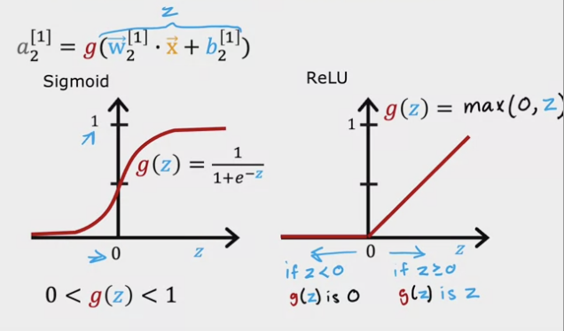
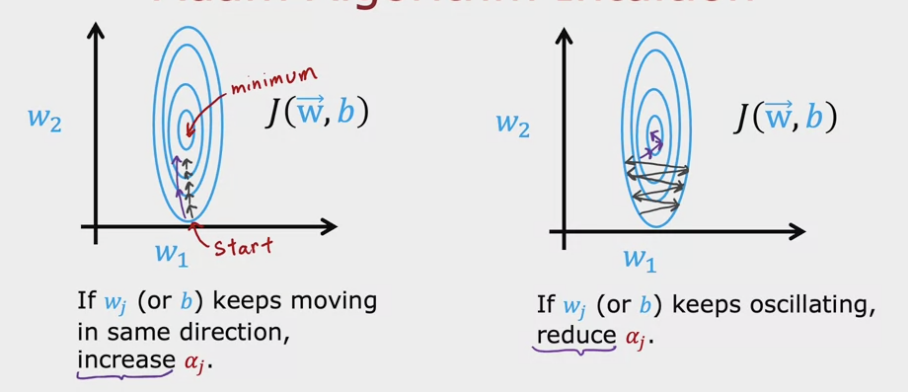

---
# Page title
title: "Week 2: Neural Network Training"

# Page summary for search engines.
summary: Notes on week 2

# Date page published
date: 2022-08-2

type: book

toc: true

# Position of this page in the menu. Remove this option to sort alphabetically.
weight: 1
---

# Train a Neural Network in Tensorflow 

Given a simple feed-forward network, and a set of training example $(x, y)$, how do we train the network? 

Let's look at the details of these steps when we did this for logistic regression:

1. Specify how to compute the output, $f_{\mathbf w, b}(\mathbf x)$ given the input $\mathbf x$, and parameters $\mathbf w, b$. 
2. Specify the loss, $L(f_{\mathbf w, b}(\mathbf x), y)$ and cost, $J(\mathbf w, b) = \frac{1}{m}\sum_{i=1}^m L(f_{\mathbf w, b}\left(\mathbf x^{(i)}), y^{(i)}\right)$. 
3. Train on data to minimize $J(\mathbf w, b)$.

## 1. Create the model 

The neural network model we will use is: 

```python 
import tensorflow as tf
from tensorflow.keras import Sequential 
from tensorflow.keras.layers import Dense
Sequential([
    Dense(units=25, activation="sigmoid"),
    Dense(units=15, activation="sigmoid"),
    Dense(units=2, activation="sigmoid"),
])
```

This specifies a set of dense layers, with sigmoid activation functions. We therefore know the parameters that are involved in our model. Each activation function is a sigmoid, $a_j^{[i]} = g(z_j^{[i]})$, where $z_j^{[i]} = \mathbf w_j^{[i]} \cdot \mathbf a^{[i-1]} + b_j^{[i]}$, where $j$ labels the node within the dense layer, and $i$ labels the layer. 

## 2. Loss and cost functions

Taking the MNIS digit recognition task, we have a binary classification problem. The most common is to use binary cross entropy, which we saw before in logistic regression: 

$$
L(f(\mathbf x), y) - - y \log(f(\mathbf x)) - (1 - y)(1 - f(\mathbf x)).
$$

This loss function is used by doing: 
```python
from tensorflow.keras.losses import BinaryCrossentropy
model.compile(loss=BinaryCrossentropy())
```
The loss we are using here is defined for a single training example (remember the use of **loss** vs **cost** in our teminology). Tensorflow then knows that what we want is to minimize the average of this cost over all training samples. 

## 3. Gradient Descent

In order to compute the parital derivative terms with respect to network parameters Tensorflow implements backpropagation behind the scenes. This is all done when using:

```python
model.fit(X, y, epochs=100)
```

# Activation Functions

We can interpret a feed-forward network by thinking about the meaning of the features in the first layer. Perhaps we are trying to extract numbers representing certain things about our datasets that are best represented by numbers on a fixed interval (like the ouput of a sigmoid function), or perhaps that are allowed to take on any real postitive number (like the output of the relu function). Choosing which activation to use it part of the tuning process for a model. 



## Choosing Activation Functions

### Output Layer

The interpretation of the output layer will often make the activation choice of the final layer quite natural. For example, if the output is:

- *Binary classification*: sigmoid. 
- *Regression*: 
    - Output +ve or -ve: linear activation,
    - Output strictly +ve: ReLU.


### Hidden Layers

The most common choice tends to be ReLU. This is for a couple of reasons:

- Faster to compute ReLU.
- ReLU is only flat in one area of the graph, whereas sigmoid is flat in two places. Gradient descent will be slower when dealing with such flat regions. 

> Go read about LeakyReLU!

## Why do we need Activation Functions? 

If we were to use linear activations for every node, then mathematically the output is equivalent to just doing linear regression. 

# Multiclass Classification

## Softmax

Generalization of logistic regression to the multiple class case. Let's consider the case where we have four possible categories $y=1, 2, 3, 4$: 

$$
z_1 = \mathbf w_1 \cdot \mathbf x + b_1, \\
z_2 = \mathbf w_2 \cdot \mathbf x + b_2, \\
z_3 = \mathbf w_3 \cdot \mathbf x + b_3, \\
z_4 = \mathbf w_4 \cdot \mathbf x + b_4.
$$

We then calculate:

$$
P(y=i | \mathbf x) = a_i = \frac{e^{z_i}}{e^{z_1} + e^{z_2} + e^{z_3} + e^{z_4}}.
$$

In summary, softmax regression is doing: 

$$
a_j = \frac{e^{z_j}}{\sum_{k=1}^N e^{z_k}}.
$$

### Cost function for softmax regression

$$
{\rm loss}(a_1, a_2, \dots, a_N) = \begin{cases} 
    -\log a_1 \quad {\rm if}~y = 1 \\
    -\log a_2 \quad {\rm if}~y = 2 \\
    \quad \vdots \\
    -\log a_N \quad {\rm if}~y = N.
\end{cases}
$$

## Softmax in Tensorflow 

> Note there is an improved implementation c.f. this code. DO NOT USE THIS CODE.

```python
import tensorflow as tf
from tensorflow.keras import Sequential
from tensorflow.keras.layers import Dense
model = Sequential([
    Dense(units=25, activation="relu"),
    Dense(units=15, activation="relu"),
    Dense(units=10, activation="softmax")
])
from tensorflow.keras.losses import SparseCategoricalCrossEntropy
model.compile(loss=SparseCategoricalCrossEntropy())
```

## Improved Implementation of Softmax

The implementation above can suffer from numerical round-off error due to the exponentiation of numbers that could be in principle very large or very small. 

We can instead output from our network the **logits**, $z_i$, and tell the cost function to use those, instead of the compute probabilities, to estimate the loss. This allows Tensorflow to implement a calculation of the loss that avoids exponentiating large and small numbers. 

The code would then change to this: 

```python
model = Sequential([
    Dense(units=25, activation="relu"),
    Dense(units=15, activation="relu"),
    Dense(units=10, activation="linear")
])
from tensorflow.keras.losses import SparseCategoricalCrossEntropy
model.compile(loss=SparseCategoricalCrossEntropy(from_logits=True))
```
Note that:
1. Our network now outputs a final layer with a "linear" activation function. 
2. We have passed the `from_logits=True` argument to the `SparseCategoricalCrossEntropy`.

Once we have trained out network, we can still access the probabilities of the various class labels by taking the softmax of the output layer:

```python
logit = model(x)
f_x = tf.nn.sigmoid(logit)
```

## Advanced Optimization 

### Adam

> Do a deep-dive on the Adam optimizer paper. 



