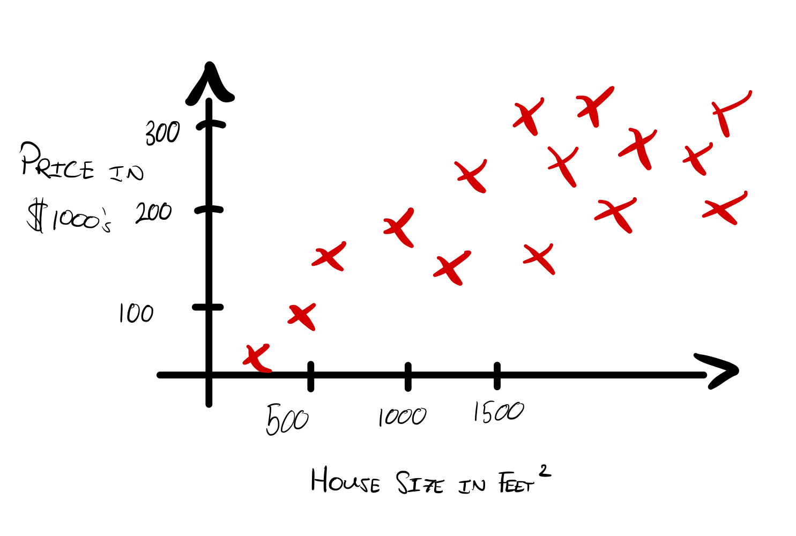
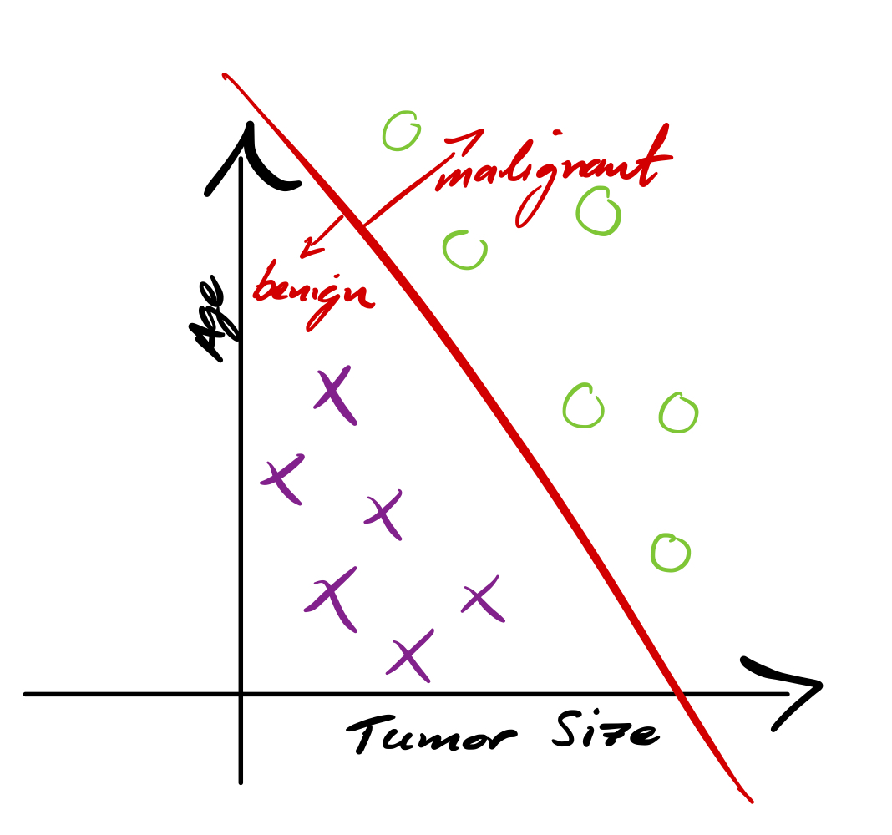

---
# Page title
title: "Week 1: Introduction to Machine Learning"

# Page summary for search engines.
summary: Notes on week 1

# Date page published
date: 2022-07-31

type: book

# Position of this page in the menu. Remove this option to sort alphabetically.
weight: 1
---

# Overview of Machine Learning

Definition of *machine learning*: 

> The ability of a computer to learn without explicit programming.s

**Supervised learning** is used the most in real-world scenarios, and has seen the most rapid advancements in recent years. The first and second courses in this specialization will focus on supervised learning.

**Unsupervised learning** will be covered in course three, and will cover recommender systems and reinforcement learning.

> This course will cover a lot of practical adice for applying learning algorithms.

## Supervised Learning

Andrew Ng claims that 99% of the economic value generated by machine learning today is due to supervised learning.

> Learns from input data that has been labelled for a specific output. 

Examples: 

- Text: email junk filter
- Audio: text transcriptions
- Online advertising

### Regression

To understand the application of regression, let's take a look at a specific example. In this case, house prices as a function of size:

If you would like to know the price of a house of a size not corresponding to an existing data point, one can apply learning algorithms to create a model of the data, and use this to predict new values. 

> One of the topics in this class is figuring out when to fit a straight line, or a curved line, based on the data.

### Classification

To understand classification, let's look at breast cancer detection. One can cast the problem of breast cancer detection into a classification problem where the classes are: malignant, or benign. 

One reason that this is different from regression is that we are trying to predict category, rather than the value of a continuous variable.

> *Classification* algorithms predict **categories** from a finite set of possible options.

Classification problems may have multiple inputs, and multiple categories:

## Unsupervised Learning

> In the case of **unsupervised learning**, we are given **unlabeled** data, $x$. Instead of seeking to predict an output $x \rightarrow y$, we are looking to **find structure in the dataset**.

Types of unsupervised learning algorithms:

- Clustering: group similar data points together
- Anomaly detection: find unusual data points
- Dimensionality reduction: compress data

