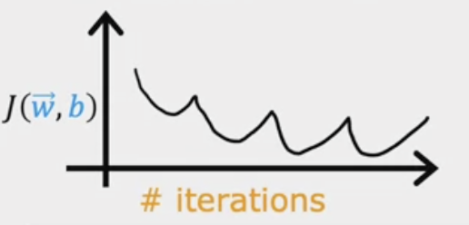
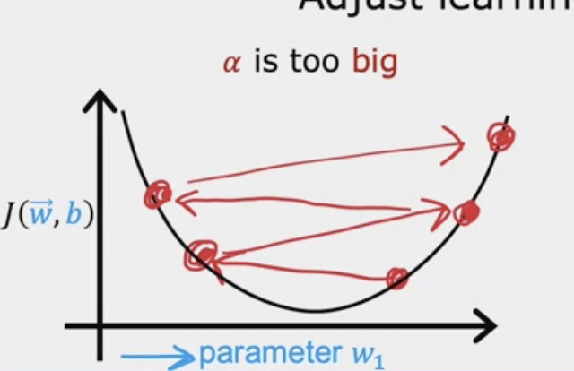

---
# Page title
title: "Week 2: Introduction to Machine Learning"

# Page summary for search engines.
summary: Notes on week 2

# Date page published
date: 2022-07-30

type: book

# Position of this page in the menu. Remove this option to sort alphabetically.
weight: 1
---

# Multivariate Linear Regression 

Terminology: 

- $x_j$ is the list of features, $x_j = \{ x_1, x_2, \dots x_n \}$. 
- $n$ is the number of features.
- $\bm x^{(i)}$ is the feature vector of the $i^{th}$ training example. 
- $x_j^{(i)}$ is the $j^{th}$ feature of the $i^{th}$ training example. 

Our model for the data is now: 

$$
f_{w, b}(\bm x) = \bm w \cdot \bm x + b
$$

In the house price regression example, $x_1$ may be the size, $x_2$ may be the number of bedrooms, $x_3$ may be the number of floors, etc... each of the coefficients $w_i$ control the response of the price to each of these feaures. 

Our cost function is then: 

$$
J(\bm w, b) = \frac{1}{2m} \sum_{i=1}^m (f_{\bm w, b}(\bm x^{(i)}) - \bm y^{(i)})^2.
$$

Applying the gradient descent algorithm:

$$
\bm{w}^{i + 1} = \bm{w}^i - \alpha \frac{\partial J(\bm w, b)}{\partial \bm w} \\
b^{i + 1} = b^i - \alpha \frac{\partial J(\bm w, b)}{\partial b}
$$

We can write down an analytic expression for these gradient updates by differentiating the cost function: 

$$
\frac{\partial J(\bm w, b)}{\partial \bm w} = \frac{1}{m} \sum_{i=1}^m (f_{\bm w, b}(\bm x^{(i)}) - \bm y^{(i)}) \bm x^{(i)}
$$

As we have written it here, this is **batch gradient descent**. This means we take the average of the gradient over the entire training dataset before making the update. For small datasets this is fine, but as we move to larger datasets it becomes difficult to fit the entire model and dataset into memory. The alternatives are:

- **Stochastic gradient descent**: where we take a single example at a time to update. 
- **Mini-batch gradient descent**: where we perform gradient updates on mini-batches of data. 

# Practical tips for gradient descent 

## Feature scaling

### Max normalization 

In this case we normalize by the largest value per feature: 

$$
\bm x^{(i)} \rightarrow \bm x^{(i)} / {\rm max}(\bm x)
$$

where the maximum is taken over examples in the training set.

### Mean normalization 

In this case we are normalizing to the interval $(-1, 1)$ for each feature. To do this, we calculate:

$$
\bm x^{(i)} \rightarrow \frac{\bm x^{(i)} - \bm \mu }{{\rm max}(\bm x) - {\rm min}(\bm x)}
$$

### Z-score normalization 

First calculate the mean and standard deviation, and then scale the distribution per feature to the normal distribution. 

$$
\bm x^{(i)} \rightarrow \frac{\bm x^{(i)} - \bm \mu }{\bm \sigma}
$$

## Checking gradient descent for convergence

Look for flattening of the loss curve over training epochs. You can look for metrics, such as the percentage change in the loss function per epoch.

## Choosing the learning rate

The learning rate can have a large effect on the convergence of training. For example, a learning rate that is too large can overshoot the minimum of the loss function. This effect can often be seen in the learning curve: 

The peaks in the learning curve correspond to updates that overshoot the minimum in the loss function:

If the learning rate is too large, the learning curve could diverge entirely. The solution is to use a smaller learning rate to gradually reach the minimum.

> **Debugging tip**: with a small enough learning rate, the cost function should decrease on every iteration. Just set $\alpha$ to a very small number. Could be helpful in finding bugs!

Try to first bound the range of possible learning rates by establishing what learning rate is too large (unstable learning curve), and too small (no improvement in the learning curve), and within that range slowly increase learning rate to get the best improvement.

## Feature engineering

The choice of features can have a huge impact on the success of a learning algorithm, and is often a **critical step**. Back to the house price regression example.

One coule imagine being given the housing dataset, where instead of the square footage of the lot, we are given the frontage (width) and depth of the lot. We could build a model regressing against those features, however you might instead builg a new feature corresponding to the area of the plot, and regress against that as well (or instead).

## Polynomial regression

For a more flexible set functions, we might include powers of our features: 

$$
f_{\bm w, b}(x) = w_1 x + w_2 x^2 + w_3 x^3 \dots + b.
$$

You might also include fractional powers. We need to come up with a process to decide how to include which features, both engineered and original. 