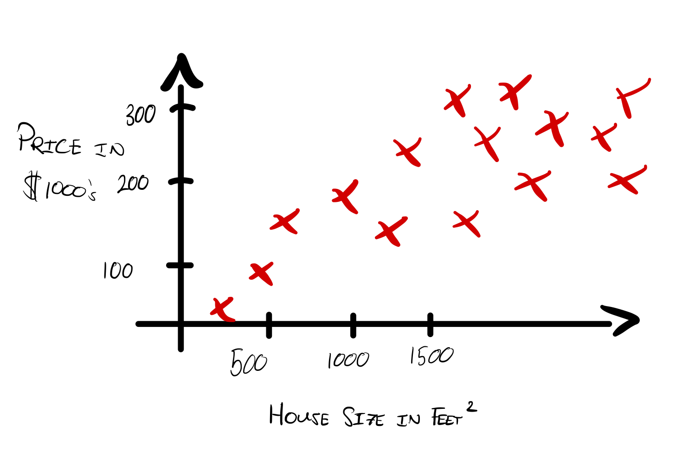

---
# Page title
title: "Week 1: Introduction to Machine Learning"

# Page summary for search engines.
summary: Notes on week 1

# Date page published
date: 2022-07-31

type: book

# Position of this page in the menu. Remove this option to sort alphabetically.
weight: 1
---

## Overview of Machine Learning

Definition of *machine learning*: 

> The ability of a computer to learn without explicit programming.s

## Supervised vs Unsupervised Machine Learning

*Supervised learning* is used the most in real-world scenarios, and has seen the most rapid advancements in recent years. The first and second courses in this specialization will focus on supervised learning.

*Unsupervised learning* will be covered in course three, and will cover recommender systems and reinforcement learning.

> This course will cover a lot of practical adice for applying learning algorithms.

### Supervised Learning

Andrew Ng claims that 99% of the economic value generated by machine learning today is due to supervised learning.

> Learngs by being given the correct answer. 

Examples: 

- Text: email junk filter
- Audio: text transcriptions
- Online advertising

#### Housing prices example

If you would like to know the price of a house of a size not corresponding to an existing data point, one can apply learning algorithms to create a model of the data, and use this to predict new values. 

> One of the topics in this class is figuring out when to fit a straight line, or a curved line, based on the data.

### Unsupervised Learning

## Regression Model

## Training the Model