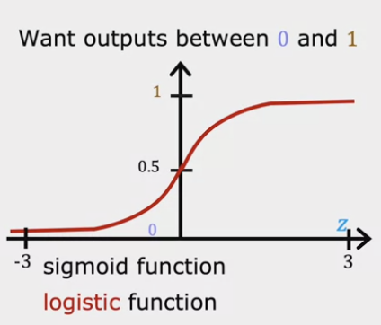
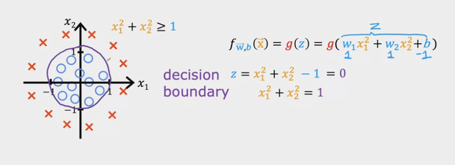
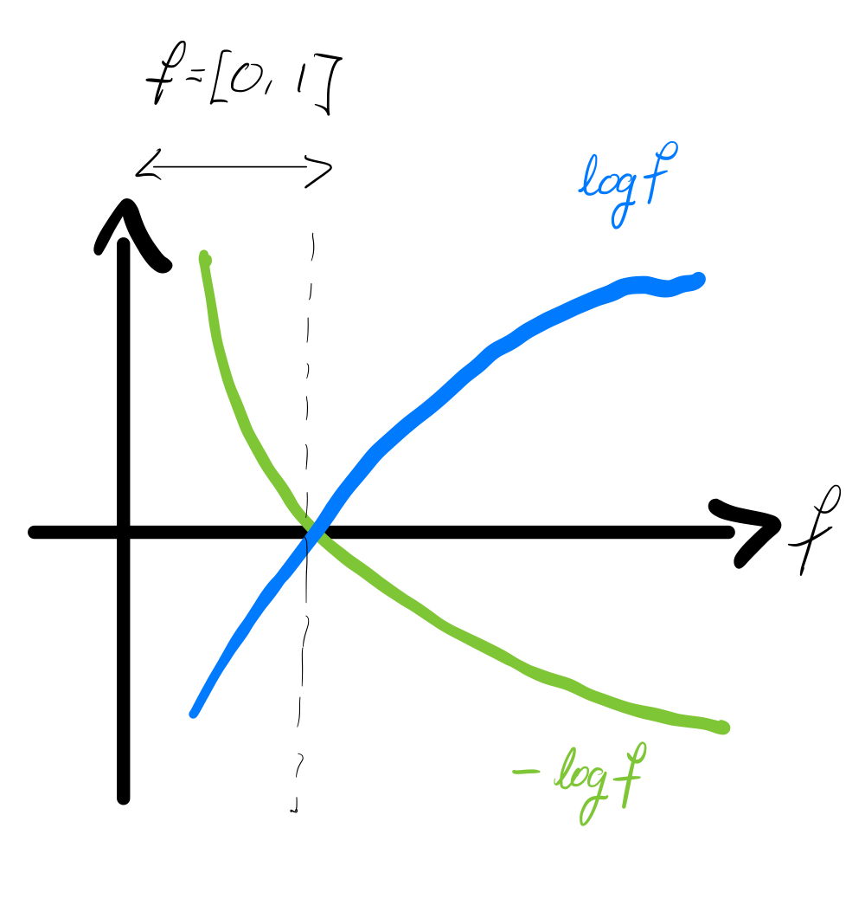
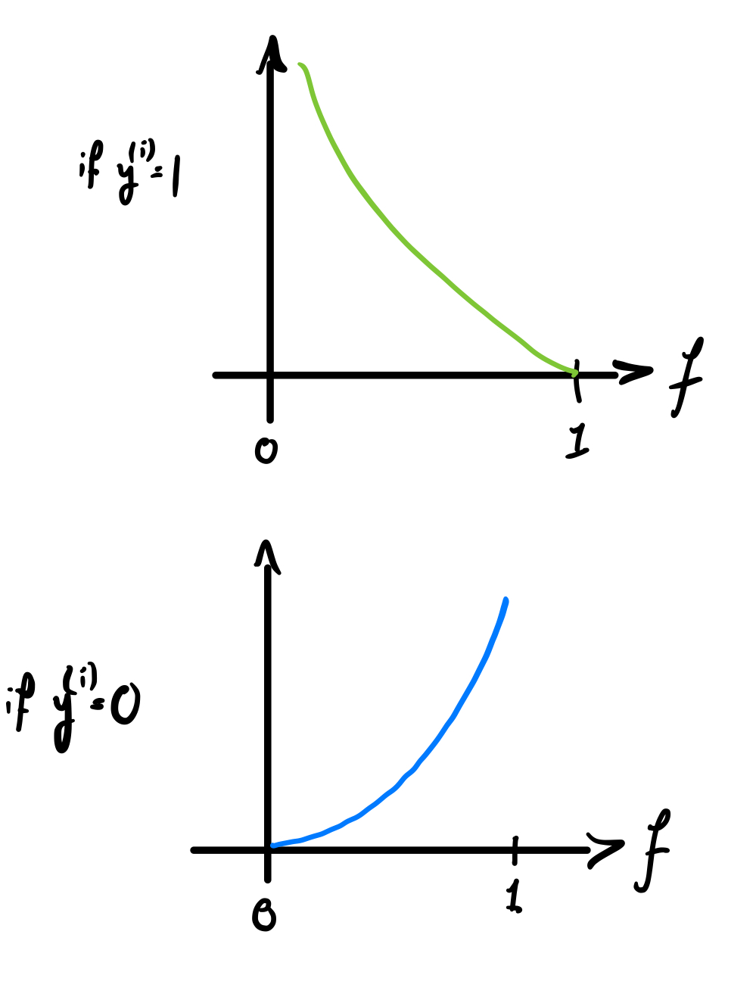

---
# Page title
title: "Week 3: Classification"

# Page summary for search engines.
summary: Notes on week 3

# Date page published
date: 2022-07-30

type: book

# Position of this page in the menu. Remove this option to sort alphabetically.
weight: 1
---

# Logistic Regression

> Used to solve binary classification problems.

For the exposition on logistic regression we will use the example of classifying tumors into two categoris: malignant (1) and benign (0).

The most important function in this section will be the **logistic**, or **sigmoid, function**:

$$
g(z) = \frac{1}{1 + e^{-z}}
$$

It is plotted here:

Characteristics of this function:

- Output is always between zero and one.
- Smooth and continuout on $(- \infty, \infty)$. 
- Shart transition that can be used to represent the *decision boundary*.

Our **logistic regression model** is:

$$
f_{\mathbf w, b}(\mathbf x) = \frac{1}{1 + e^{-(\mathbf w \cdot \mathbf x + b)}}
$$

We can then interpret the output of this function as the probability of the input belonging to the class (1), i.e. $f_{\mathbf w, b}(\mathbf x) = P(y=1|\mathbf x; \mathbf w, b)$.

## Decision Boundary 

A key feature of the logistic regression is the point at which the decision changes from negative to positive. By inspection of the form of the function, you can see that this happend when $g(z)=0$. This corresponds to:

$$
z = \mathbf w \cdot \mathbf x + b = 0
$$

When our feature space is multidimensional, this corresponds to a line, or indeed a plane or hyperplane. The limitation of this model then becomes clear, as it would not be able to discrimante between more complext distributions of categories, where a decision line or plane is not sufficient. In such cases we would need a non-linear decision boundary. For example, one could get a **circular decision boundary** with the function:

$$
f_{\mathbf w, b}(\mathbf x) = g(z) = g(w_1 x_1^2 + w_2 x_2^2 + b)
$$

One can create even more complicated decision boundaries by including higher order polynomial terms. 

## Cost Function for Logistic Regression

Reason why MSE won't work: 

Let's write down the loss, and justify it in a minute: 

$$
L\left(f_{\mathbf w, b}(\mathbf x^{(i)}), y^{(i)}\right) = \begin{cases} 
    -\log \left( f_{\mathbf w, b}(\mathbf x^{(i)}) \right)\quad \quad{\rm if}~y^{(i)}=1 \\
    -\log \left( 1 - f_{\mathbf w, b}(\mathbf x^{(i)}) \right)~{\rm if}~y^{(i)}=0
\end{cases}
$$

First, consider the function $\log f$:

Since our model treats $f$ as a probability, its outputs are only between $0$ and $1$. Therefore, we zoom in on the first part of the graph, before $\log f$ intersects the horizontal axis: 

