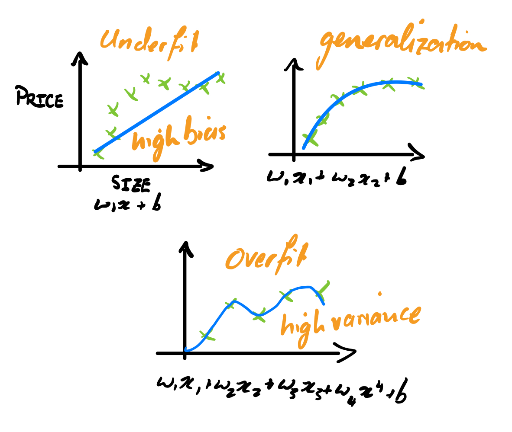

---
# Page title
title: "Week 3: Classification"

# Page summary for search engines.
summary: Notes on week 3

# Date page published
date: 2022-07-30

type: book

toc: true

# Position of this page in the menu. Remove this option to sort alphabetically.
weight: 1
---

# Logistic Regression

> Used to solve binary classification problems.

For the exposition on logistic regression we will use the example of classifying tumors into two categoris: malignant (1) and benign (0).

The most important function in this section will be the **logistic**, or **sigmoid, function**:

$$
g(z) = \frac{1}{1 + e^{-z}}
$$

It is plotted here:


Characteristics of this function:

- Output is always between zero and one.
- Smooth and continuout on $(- \infty, \infty)$. 
- Shart transition that can be used to represent the *decision boundary*.

Our **logistic regression model** is:

$$
f_{\mathbf w, b}(\mathbf x) = \frac{1}{1 + e^{-(\mathbf w \cdot \mathbf x + b)}}
$$

We can then interpret the output of this function as the probability of the input belonging to the class (1), i.e. $f_{\mathbf w, b}(\mathbf x) = P(y=1|\mathbf x; \mathbf w, b)$.

## Decision Boundary 

A key feature of the logistic regression is the point at which the decision changes from negative to positive. By inspection of the form of the function, you can see that this happend when $g(z)=0$. This corresponds to:

$$
z = \mathbf w \cdot \mathbf x + b = 0
$$

When our feature space is multidimensional, this corresponds to a line, or indeed a plane or hyperplane. The limitation of this model then becomes clear, as it would not be able to discrimante between more complext distributions of categories, where a decision line or plane is not sufficient. In such cases we would need a non-linear decision boundary. For example, one could get a **circular decision boundary** with the function:

$$
f_{\mathbf w, b}(\mathbf x) = g(z) = g(w_1 x_1^2 + w_2 x_2^2 + b)
$$


One can create even more complicated decision boundaries by including higher order polynomial terms. 

## Cost Function for Logistic Regression

Reason why MSE won't work: 

Let's write down the loss, and justify it in a minute: 

$$
L\left(f_{\mathbf w, b}(\mathbf x^{(i)}), y^{(i)}\right) = \begin{cases} 
    -\log \left( f_{\mathbf w, b}(\mathbf x^{(i)}) \right)\quad \quad{\rm if}~y^{(i)}=1 \\
    -\log \left( 1 - f_{\mathbf w, b}(\mathbf x^{(i)}) \right)~{\rm if}~y^{(i)}=0
\end{cases}
$$

First, consider the function $\log f$:


Since our model treats $f$ as a probability, its outputs are only between $0$ and $1$. Therefore, we zoom in on the first part of the graph, before $\log f$ intersects the horizontal axis: 


Going case-by-case, we can see that this function provides the correct penalties. 

1. In the case $y^{(i)}=1$, if the model $f(x^{(i)})$ outputs something close to $0$, it is highly penalized, whereas the loss is low if it outputs something close to $1$. 
2. In the case $y^{(i)}=0$, if the model outputs something close to $1$ it is highly penalized, and if it outputs something close to $0$ it is not penalized. 

The logistic logistic cost function over our whole dataset is then:

$$
J(\mathbf w, b) = \frac{1}{m}\sum_{i=1}^m L(f(\mathbf x^{(i)}, y^(i))).
$$

> It is woth noting that this cost function is **convex** in the parameters $\mathbf w, b$, which would not be the case for the MSE on a logistic model. This makes the optimization process *much* more efficient, and ensures it will reach a **global minimum**.

### Convex Functions 

[Definition form wikipedia](https://en.wikipedia.org/wiki/Convex_function):

| A real-valued function is called convex if the line segment between any two points on the graph of the function does not lie below the graph between the two points.

Practically, a twice-differentiable function of a single variable is convex if and only if its second derivative is nonnegative on its entire domain. 

This results in a first derivative that is monotonically increasing.

We can show that the logistic cost function is convex in the parmaeters $\mathbf w, b$ by considering its derivatives w.r.t those parameters. 

One can split the proof of the convexity of the logistic loss function into two steps: 

1. Show that the functions $\log(f_{\mathbf w, b}(z))$ is convex in $z$. 
2. Show that a twice-differentiable convex function of an affine function is a convex function. 

There is a good posting on [stack overflow](https://math.stackexchange.com/questions/1582452/logistic-regression-prove-that-the-cost-function-is-convex) going through this derivation. 

### Simplified Loss Function 

We can write the loss function in a simpler way, due to the fact that $y$ can only take the values $0$ or $1$: 

---
**Logistic loss function**
$$
L\left(f_{\mathbf w, b}\left(\mathbf x^{(i)}\right), y^{(i)}\right) = - y^{(i)} \log\left(f_{\mathbf w, b}\left(\mathbf x^{(i)}\right)\right) - (1 - y^{(i)}) \log \left(1-f_{\mathbf w, b}\left(\mathbf x^{(i)}\right) \right)
$$
---
**Logistic cost function**
$$
J(\mathbf w, b) = - \frac{1}{m} \sum_{i=1}^m \left[ y^{(i)} \log(f_{\mathbf w, b}(\mathbf x^{(i)})) + \left(1 - y^{(i)} \right) \log\left(1 - f_{\mathbf w, b} \left(\mathbf x^{(i)}\right)\right) \right]
$$
---
Of course, in principle, there are many other functions that could satisfy the requirements we have specified so far. It turns out that this form of the cost function is:

- *maximum likelihood solution*,
- *convex*. 

### Logistic loss function as maximum likelihood solution

The logistic function is closely related to the Bernoulli distribution. 


## Gradient Descent for Logistic Regression

As before, the gradient-based update procedure for the weights and bias is: 

$$
w_j = w_j - \alpha \frac{\partial}{\partial w_j} J(\mathbf w, b) \\ 
b = b - \alpha \frac{\partial}{\partial b} J(\mathbf w, b)
$$

We can take derivatives of the cost function to find:

$$
\frac{\partial}{\partial w_j}J(\mathbf w, b)= \frac{1}{m} \sum_{i=1}^m \left(f_{\mathbf w, b}\left(\mathbf x^{(i)}\right) - y^{(i)}\right)\mathbf x_j^{(i)}, \\
\frac{\partial}{\partial b}J(\mathbf w, b)= \frac{1}{m} \sum_{i=1}^m \left(f_{\mathbf w, b}\left(\mathbf x^{(i)}\right) - y^{(i)}\right).
$$

As in the case of linear regression, there are a few concepts that can be important during training: 

- Monitoring gradient descent (learning curve),
- Vectorized implementation,
- Feature scaling.


# Example of Logistic Regression using `scikit-learn`

```python 
import numpy as np

X = np.array([[0.5, 1.5], [1,1], [1.5, 0.5], [3, 0.5], [2, 2], [1, 2.5]])
y = np.array([0, 0, 0, 1, 1, 1])

from sklearn.linear_model import LogisticRegression

lr_model = LogisticRegression()
lr_model.fit(X, y)
```

Then use the trained model to predict some new outputs: 

```python
y_pred = lr_model.predict(X)
print("Prediction on training set:", y_pred)
```

```stdout
Prediction on training set: [0 0 0 1 1 1]
```

```python 
print("Accuracy on training set:", lr_model.score(X, y))
```

```stdout
Accuracy on training set: 1.0
```

# Overfitting

Going back to the linear regression example of predicting housing prices. In the case that we have only one feature, say size of the house, we can consider what happens as we fit modles of increasing complexity to the data:



1. **Fitting a linear term**: This model underfits the data, and results in **high bias**. 
2. **Fitting a quadratic function**: This seems to be just right. 
3. **Fitting a fourth order polynomial**: this *overfits* the data. This can also be called **high variance** because if one of the data points changes only slightly, the resulting model fit can change dramatically. 