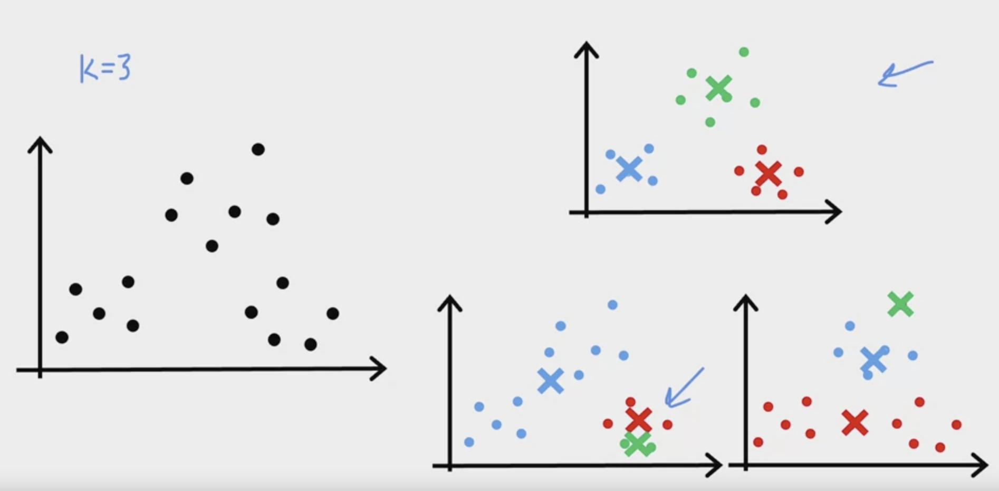
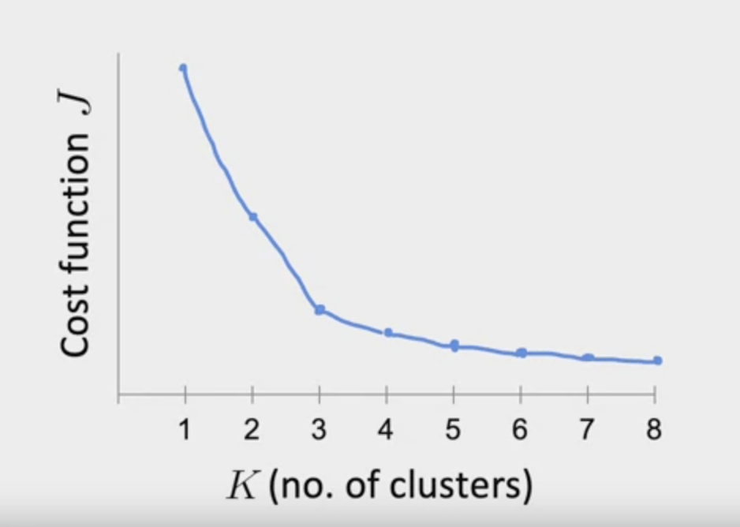
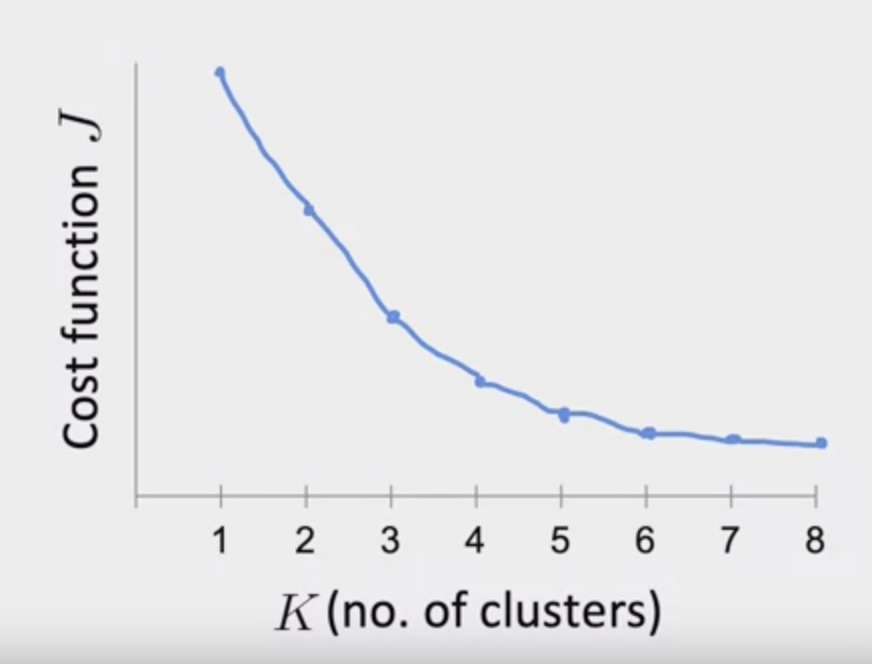

---
# Page title
title: "Week 1: Clustering"

# Page summary for search engines.
summary: Notes on week 1

# Date page published
date: 2022-08-03

type: book

# Position of this page in the menu. Remove this option to sort alphabetically.
weight: 1
---

# $k$-means

## Algorithm

1. Randomly initialize $k$ cluster centroids, $\{ \mu_1, ..., \mu_k\}$.
2. Lay down centroids randomly. 
3. Loop through all data points and calculate which centroid is closer.
4. Assign cluster points to closest centroid.
5. Compute average of each group.
6. Move centroids to average position. 
7. If there is no change, stop, else go back to step (3).

## Optimization Objective 

Average squared difference between each point, and the cluster center to which it has been assigned, also known as the **distortion function**:

$$
J(c^{(1)}, \dots, c^{(m)}, \mu_1, \dots, \mu_k) = \sum_{i=1}^m || x^{(i)} - \mu_{c^{(i)}} ||^2 \\

{\rm min}_{c^{(1)}, \dots, c^{(m)}, \mu_1, \dots, \mu_k} J(c^{(1)}, \dots, c^{(m)}, \mu_1, \dots, \mu_k)
$$

It turns out that both steps: the assignment of points to the nearest centroid, and then moving the centroid to the average of the current group, both minimize the cost function. 

> On every iteration of $k$-means the cost should decrease. Any increase indicates a bug in the code. 

## Initializing Cluster Centroids

Firstly, should always choose $K < m$. 

Randomly pick $K$ training samples, set $\{ \mu_1, \dots, \mu_k\}$ equal to these.

The result of $k$-means can strongly depend on initialization of the centroids. The algorithm can get stuck in local minimia:

To get around this, we can run the algorithm multiple times and find the best local optimum. One could run the algorithm $N$ times, and choose the resuling clustering with the lowest cost function. In the diagram above, that would likely correspond to the case in the top right. 

## Choosing Number of Clusters 

For many problems, the "right" value of $k$ is completely ambiguous. We need a consistent algorithm to get consistent results. Because clustering is an unsupervised algorithm, we don't have the right answers to indicate how many clusters there really are. 

In the literature on $k$-means, there are a few algorithms on how to choose $k$. One way to choose a value (not recommended) is the *Elbow* method, where one plots the cost function as a function of the number of clusters. 

From the curve you try and find the "elbow" where the improvement of adding more clusters slows down. 

In reality, curves tend to be very smooth, and so finding a real "elbow" can be very undefined: 

> You **can not* just choose the $k$ that minimizes $J$, as that will usually just be the largest possible value of $k$. 

Typically, there will be a downstream use of the clustering results, you may define a metric for how well the clustering performs for that later purpose in order to choose $k$. 